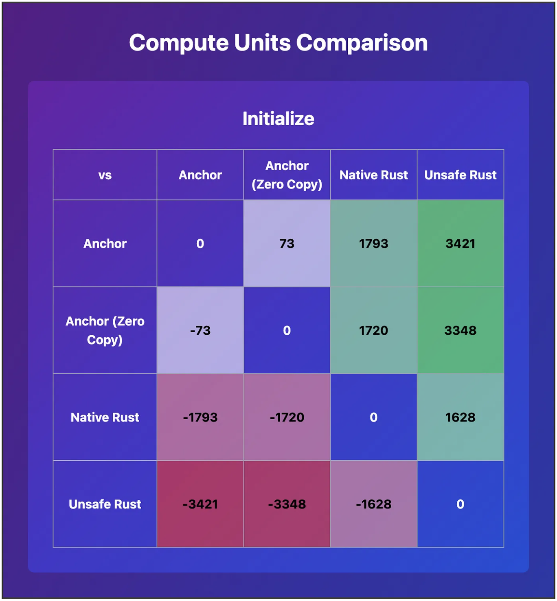
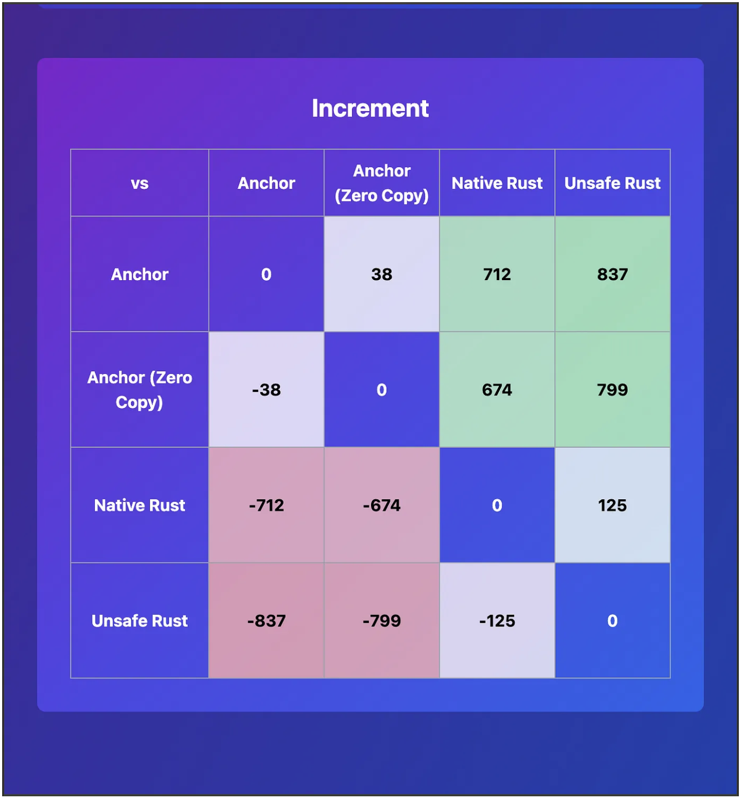

# Solana Program Optimization Comparison

This repository contains different implementations of a simple counter program on Solana, demonstrating various optimization techniques.

## Performance Comparison

### Initialize

### Increment

## Summary of Findings

Detailed blog post [Optimizing Solana Programs](https://medium.com/@het2341999/optimizing-solana-programs-26c7ddd0299c), in summary:

1. **Anchor vs Native Rust**: Anchor provides a higher-level abstraction and better developer experience, but it comes with a performance cost. Native Rust implementations are generally faster and more efficient.

2. **Zero-Copy**: Utilizing zero-copy deserialization can significantly improve performance, especially for larger data structures. It reduces CPU usage and allows for faster data access.

3. **Unsafe Rust**: Using unsafe Rust can provide additional performance benefits, but it comes with increased responsibility for ensuring memory safety and correctness.

4. **Performance Differences**:
   - Initialization: Unsafe Rust is the fastest, followed by Native Rust, Zero-Copy Anchor, and standard Anchor.
   - Increment: The performance gap narrows for simpler operations, but Unsafe Rust and Native Rust still outperform Anchor implementations.

5. **Trade-offs**: While native and unsafe implementations offer better performance, they require more careful coding and may be more prone to errors. Anchor provides safety guarantees and easier development at the cost of some performance.

6. **Optimization Strategies**: 
   - Use zero-copy when dealing with large data structures.
   - Consider native Rust for performance-critical parts of your program.
   - Leverage unsafe Rust judiciously for maximum performance, but be aware of the associated risks.

## Programs in this Repository

1. [Counter (Anchor)](./counter/README.md)
2. [Counter Zero-Copy (Anchor)](./counter-zero-copy/README.md)
3. [Native Counter (Rust)](./native-counter/README.md)
4. [Solana No-STD Entrypoint (Unsafe Rust)](./solana-nostd-entrypoint/unsafe-counter/README.md)

Please refer to the individual README files in each program's directory for specific instructions on setup, running the program, and testing.

## General Setup

1. Install Rust and Cargo
2. Install Solana CLI
3. Install Anchor (for Anchor-based programs)
4. Set up a Solana wallet for testing (you can use `solana-keygen new` to create a new keypair)

For detailed instructions on running each program and its tests, please refer to the README files in the respective program directories.

## Credits

The Solana No-STD Entrypoint implementation is based on the work from [solana-nostd-entrypoint](https://github.com/cavemanloverboy/solana-nostd-entrypoint) by [@cavemanloverboy](https://github.com/cavemanloverboy).